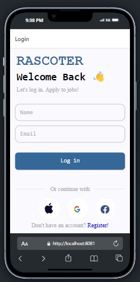
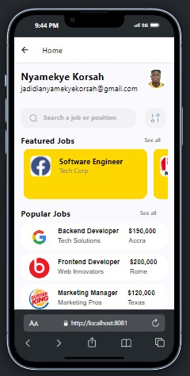

Job Portal Application
This repository contains a Job Portal application developed as part of Assignment 4 for [Your Course Name/Number].

Components Usage
Name Component
Description: Displays the user's name at the top left corner of the page in bold.
Usage: Automatically fetched from user profile after login.
Gmail Component
Description: Shows the user's Gmail address just below the name.
Usage: Automatically fetched from user profile after login.
Profile Picture Component
Description: Displays the user's profile picture at the top right corner of the page.
Usage: Automatically fetched from user profile after login.
Search Engine Component
Description: Provides a search input field for users to search for jobs or positions.
Usage: Users can enter keywords related to jobs they are looking for.
Featured Jobs Component
Description: Displays a list of featured job postings.
Usage: Shows high-profile job listings that are prominently displayed to attract user attention.
Popular Jobs Component
Description: Lists popular job postings.
Usage: Displays jobs that are currently trending or popular among users.
Job Card Component
Description: Represents each job posting with detailed information.
Usage: Used in both Featured Jobs and Popular Jobs components to display individual job details.
Screenshots

